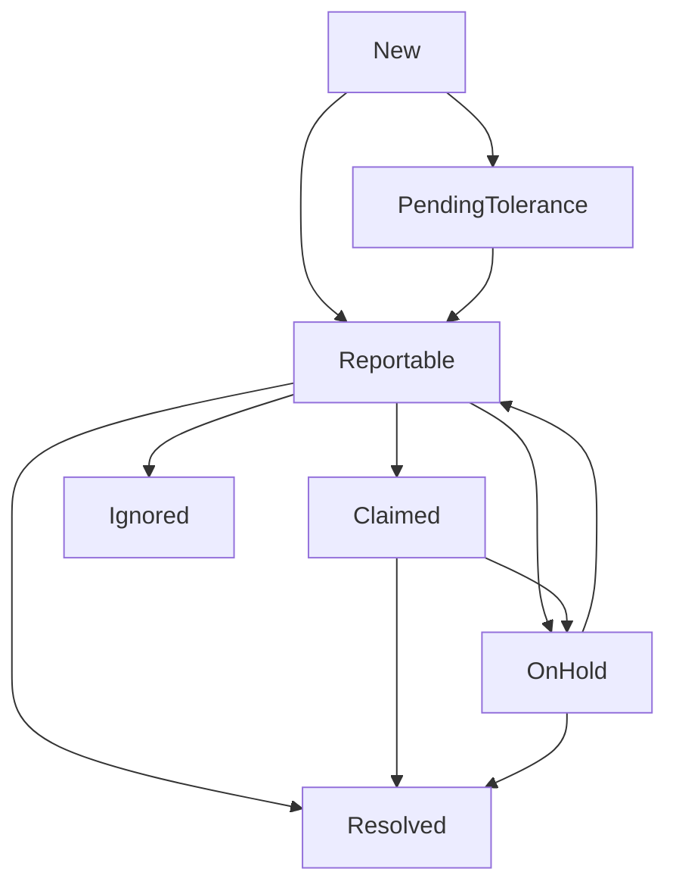

# Broken Link Lifecycle (Design)

This document defines the canonical lifecycle and human interaction model for broken external links.

## State Model

- `new`: first observed failed check for a target URL in a run.
- `pending_tolerance`: failed but still below tolerance gates.
- `reportable`: failed and passed tolerance gates; eligible for notification.
- `claimed`: a webmaster took ownership.
- `on_hold`: temporarily paused while waiting on an external party.
- `ignored`: intentionally suppressed by rule or operator decision.
- `resolved`: recovered (link checks pass again), or explicitly closed.

## Transition Rules

- `new -> pending_tolerance`
  - default path for transient failures.
- `new -> reportable`
  - immediate-failure categories or tolerance reached.
- `pending_tolerance -> reportable`
  - once tolerance reaches configured threshold.
- `reportable -> claimed`
  - operator ownership action.
- `reportable -> on_hold`
  - external dependency escalation recorded.
- `reportable -> ignored`
  - explicit suppress action.
- `claimed -> on_hold`
  - owner escalates to external maintainers and sets revisit.
- `on_hold -> reportable`
  - revisit date reached and still failing.
- `claimed|on_hold|reportable -> resolved`
  - checks pass in subsequent runs.

## Required Metadata

For every human-driven transition (`claimed`, `on_hold`, `ignored`, `resolved`):

- `actor_id`: human identity (Slack user id, or CLI user id).
- `actor_display`: optional human-friendly name.
- `channel_id`: where the action occurred.
- `message_ref`: Slack message ts/permalink or CLI command reference.
- `note`: free-form rationale.
- `until`: required for `on_hold` (review date/time).
- `created_at`: timestamp of action.

## Persistence (Blink)

- `link_alerts` — open/resolved rows with reminder counts, `hold_until`, Slack refs (`slack_channel_id`, `slack_root_ts`, `slack_thread_ts`, `slack_bootstrap_ts`), and human triage fields (`human_bucket`, `owner_actor_id`, `ignore_until`).
- `link_alert_events` — append-only audit (`alert_id`, `event_type`, `actor_id`, `payload_json`, `created_at`).
- `link_retest_queue` — pending/done immediate rechecks with Slack thread coordinates for replies.

## Slack Interaction (Implemented)

Blink posts the main broken-link alert, then (when `notifications.destinations[].lifecycle.enabled` is true and `post_alerts_via_bot` is true) opens a **thread** with instructions. Operators can:

1. **React on the parent alert message** with emoji aliases from `action_aliases` (`claim`, `on_hold`, `ignore`, `resolve`, `retest`). Emoji-driven actions apply **default durations** from the `lifecycle` block (`on_hold_default_days`, `ignore_default_days`, caps via `on_hold_max_days`, `ignore_allow_infinite`).
2. **Reply in the thread** with structured commands for overrides, for example:
   - `on_hold https://example.com/broken 14d waiting on vendor`
   - `ignore https://example.com/broken infinite not our asset`
   - `ignore https://example.com/broken 30d`
   - `retest https://example.com/broken`

Inbound events are normalized to `InboundActionEvent` (see below). Apply with `blink notifications slack handle-event --job <job.json> --event <payload.json>` for ad-hoc testing, or run `blink serve` and point Slack’s Events **Request URL** at `https://<host>/notifications/slack/job/<slug>` (see README). Requests must verify with the Slack signing secret (`notifications.slack_signing_secret_env`).

### Queued retest (`retest` / `:curly_loop:`)

Reactions or commands enqueue a row in `link_retest_queue`. Each `blink link-check run` drains pending items early in the run: one HTTP check per queued URL, then a thread reply (`still failing` vs `Retest OK`) and an audit row in `link_alert_events`.

## Inbound Action Contract (Implementation-Oriented)

Inbound provider events should be normalized to this shape before lifecycle state changes:

- `provider`: source system (`slack`, future: `discord`, `telegram`, `signal`).
- `destination_id`: configured destination key in job config.
- `action`: one of `claim`, `ignore`, `on_hold`, `resolve`, `retest`.
- `target_url`: broken link URL.
- `actor_id`: user identity from channel provider.
- `actor_display`: optional display name.
- `channel_id`: conversation location.
- `message_ref`: provider message reference for audit.
- `note`: optional (used for thread command context).
- `until`: semantic duration (`14d`, `infinite`, or ISO) for `on_hold` / `ignore` message overrides; emoji-driven `on_hold` may omit it (defaults apply).
- `source`: `reaction` vs `message` — validation treats emoji `on_hold` as not requiring `until`/`note` up front.

Validation rules:

- reject unknown actions.
- reject missing `actor_id`, `channel_id`, or `message_ref`.
- reject missing `target_url` except for emoji-driven actions where the URL is resolved from persisted Slack message timestamps on `link_alerts`.
- reject `on_hold` **message** commands when `until` is missing; emoji `on_hold` uses `on_hold_default_days`.
- reject `ignore` **message** commands when `until` is missing.

## On-Hold Heuristics

Set `on_hold` when:

- the issue is confirmed as external dependency (e.g., external SSL chain, remote 5xx outage),
- and operator provides escalation note (`who`, `where`, `when`).

Default revisit recommendations:

- SSL certificate issues: 7 days
- external 5xx instability: 2-3 days
- DNS misconfiguration outside webmaster control: 3-7 days

At revisit:

- if still failing: move to `reportable` (or keep `on_hold` with updated note),
- if passing: move to `resolved`.

## Mermaid Overview

